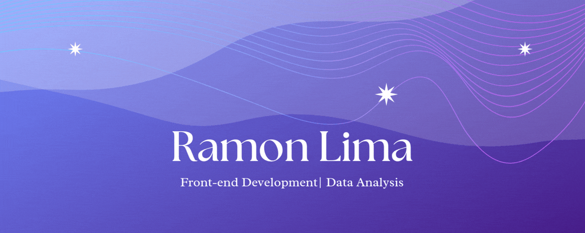

  

## About me ✧.*

My name is Ramon, and I am an undergraduate student in Computer Science at the State University of Rio Grande do Norte (UERN). I have an interest in and have developed projects in the areas of Web Development and Data Analysis. I am constantly seeking opportunities that enhance my professional growth and allow me to apply the knowledge I have acquired :)

## Skills ⋆˚࿔

### 💻 Frontend

  

### ⚙️ Backend 

  

### 🗄️ Database

  

### 🛠️ Tools

  

## Contact Me ✧.*

  
  

  

